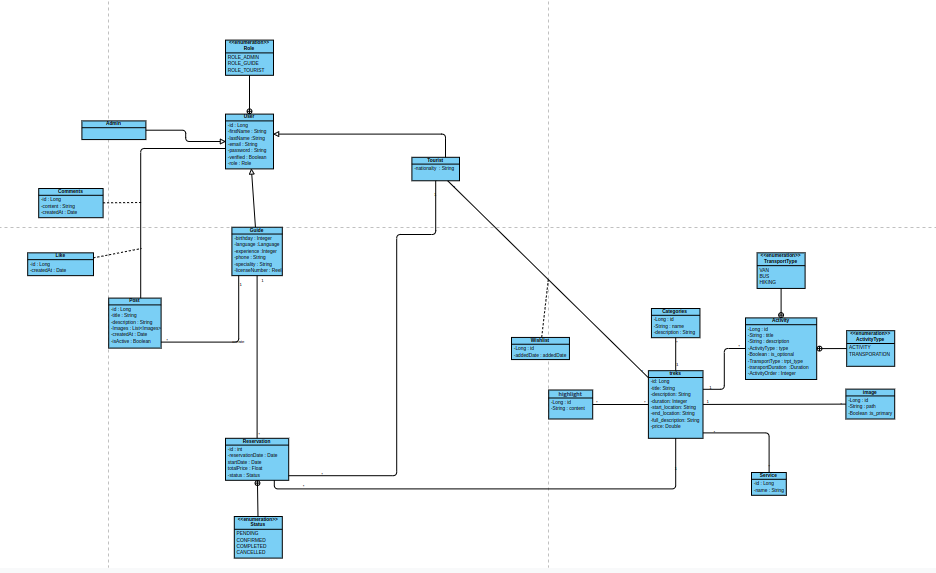

# Ourika Travel API

A Spring Boot-based REST API for managing travel and tourism services, specifically focused on the Ourika region.

## 📊 Class Diagram


## 📁 Project Structure
```
ourika-travel-api/
├── src/
│   ├── main/
│   │   ├── java/
│   │   │   └── com/
│   │   │       └── ouchin/
│   │   │           └── ourikat/
│   │   │               ├── config/
│   │   │               │   ├── FileStorageConfig.java
│   │   │               │   ├── SecurityConfig.java
│   │   │               │   └── WebConfig.java
│   │   │               ├── controller/
│   │   │               │   ├── AuthenticationController.java
│   │   │               │   ├── PostController.java
│   │   │               │   └── TrekImageController.java
│   │   │               ├── dto/
│   │   │               │   ├── request/
│   │   │               │   │   └── TrekImageRequest.java
│   │   │               │   └── response/
│   │   │               │       ├── TrekImageResponse.java
│   │   │               │       └── TrekResponse.java
│   │   │               ├── entity/
│   │   │               │   ├── Post.java
│   │   │               │   ├── Trek.java
│   │   │               │   ├── TrekImage.java
│   │   │               │   └── Wishlist.java
│   │   │               ├── mapper/
│   │   │               │   └── TrekImageMapper.java
│   │   │               ├── repository/
│   │   │               │   └── TrekImageRepository.java
│   │   │               └── service/
│   │   │                   ├── impl/
│   │   │                   │   └── TrekImageServiceImpl.java
│   │   │                   └── TrekImageService.java
│   │   └── resources/
│   │       └── application.properties
│   └── test/
│       └── java/
│           └── com/
│               └── ouchin/
│                   └── ourikat/
│                       └── [test files]
├── .gitignore
├── .mvn/
├── mvnw
├── mvnw.cmd
├── pom.xml
└── README.md
```

## 🚀 Features

- Trek Management
  - Create, update, delete, and search treks
  - Add/remove highlights and services
  - Manage trek images
  - Category-based organization

- User Management
  - Tourist and Guide roles
  - Authentication and Authorization
  - Profile management

- Post System
  - Create and manage posts with images
  - Like/Unlike functionality
  - Comment system
  - Guide-specific posts

- Reservation System
  - Trek booking
  - Guide assignment
  - Reservation status management
  - Statistics tracking

- Wishlist Management
  - Add/remove treks to wishlist
  - Tourist-specific wishlists

## 🛠 Technical Stack

- **Framework**: Spring Boot 3.4.3
- **Database**: PostgreSQL
- **Security**: JWT Authentication
- **Documentation**: SpringDoc OpenAPI
- **File Storage**: Local file system
- **Email Service**: Mailtrap
- **Testing**: JUnit 5, Mockito

## 📋 Prerequisites

- Java 23
- Maven
- PostgreSQL
- IDE (IntelliJ IDEA recommended)

## 🔧 Configuration

### Database Setup
```properties
spring.datasource.url=jdbc:postgresql://localhost:5432/ourikatravels_db
spring.datasource.username=your_username
spring.datasource.password=your_password
```

### Email Configuration
```properties
spring.mail.host=sandbox.smtp.mailtrap.io
spring.mail.port=2525
spring.mail.username=your_username
spring.mail.password=your_password
```

## 🚀 Running the Application

1. Clone the repository:
```bash
git clone [repository-url]
```

2. Navigate to project directory:
```bash
cd ourika-travel-api
```

3. Build the project:
```bash
mvn clean install
```

4. Run the application:
```bash
mvn spring-boot:run
```

The API will be available at `http://localhost:8080/api`

## 🔒 API Security

The API uses JWT-based authentication. To access protected endpoints:

1. Obtain JWT token through `/auth/login`
2. Include token in Authorization header:
```
Authorization: Bearer your_jwt_token
```

## 📝 API Endpoints

### Trek Management
- `POST /treks` - Create new trek
- `GET /treks` - List all treks
- `GET /treks/{id}` - Get trek by ID
- `PUT /treks/{id}` - Update trek
- `DELETE /treks/{id}` - Delete trek
- `GET /treks/search` - Search treks by title

### Post Management
- `POST /posts/guides/{guideId}` - Create new post
- `GET /posts/guides/{guideId}` - Get guide's posts
- `PUT /posts/{postId}` - Update post
- `DELETE /posts/{postId}` - Delete post

### User Management
- `POST /auth/register` - Register new user
- `POST /auth/login` - User login
- `PUT /users/profile` - Update user profile

### Reservation System
- `POST /reservations/tourists/{touristId}/reserve` - Create reservation
- `PUT /reservations/{id}/approve` - Approve reservation
- `PUT /reservations/{id}/cancel` - Cancel reservation

## 🧪 Testing

The project includes comprehensive unit tests. Run tests using:

```bash
mvn test
```


